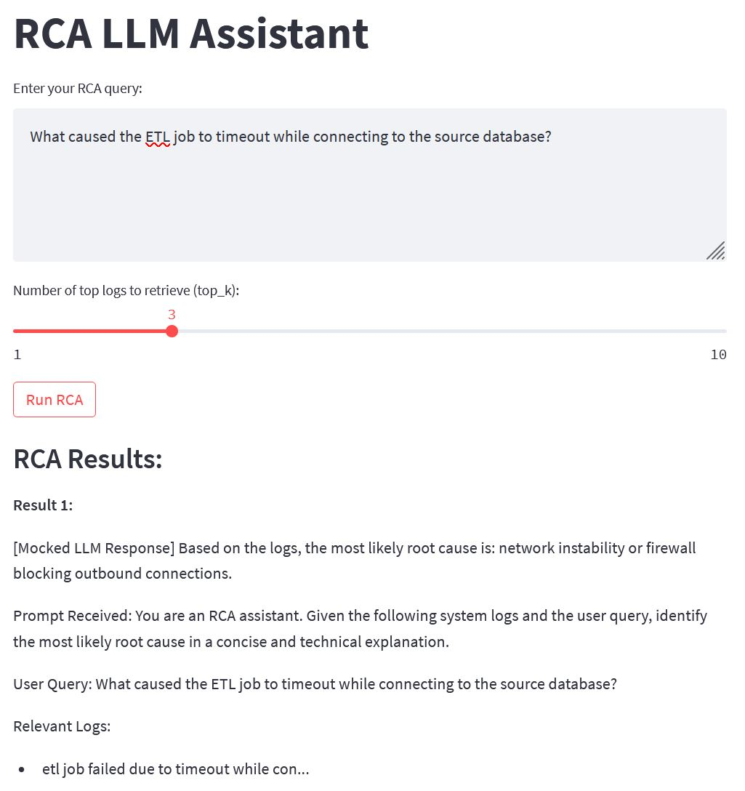

# RCA-LLM-Demo

A lightweight, cost-free, local prototype of a Root Cause Analysis (RCA) assistant using LLMs and Retrieval-Augmented Generation (RAG). This demo runs entirely on your machine using open-source tools—no cloud costs or external dependencies.

---

**Screenshot: Streamlit RCA LLM Assistant running locally in a web browser**



---

## Architecture Overview

The RCA LLM Assistant uses a modular, local-first pipeline for root cause analysis. Raw ETL logs and metadata are ingested and preprocessed into structured features. These features are embedded into dense vectors and indexed using FAISS for fast similarity search. When a user submits a query, the system retrieves the most relevant logs, constructs a prompt, and uses a local LLM to generate a concise root cause analysis. The entire workflow runs locally, ensuring privacy and zero cloud costs.

```ascii
+---------------------------------------------------------------+
|                        Data Sources                           |
|  - Local Logs   - ETL Metadata   - Simulated Failure Tickets  |
+----------------------+----------------------+-----------------+
                       | 
                       v
+---------------------------------------------------------------+
|                   Local Preprocessing (Python)                |
| - Cleans & normalizes logs                                    |
| - Extracts structured features                                |
+----------------------+----------------------------------------+
                       |
                       v
+-------------------------------+         +--------------------+
|      ML Feature Store         |         | Embedding Generator|
|      (CSV file)               |         | (SBERT, SentenceT.)|
+-------------------------------+         +--------------------+
                       |                          |
                       +-----------+--------------+
                                   |
                                   v
                        +----------------------+
                        |   Vector DB (FAISS)  |
                        +----------------------+
                                   |
                                   v
                        +----------------------+
                        |   RAG Engine         |
                        |   (Prompt Builder,   |
                        |    Retriever, etc.)  |
                        +----------------------+
                                   |
                                   v
                        +----------------------+
                        |   LLM (Local Model   |
                        |   or API)            |
                        +----------------------+
                                   |
                                   v
                        +----------------------+
                        |   Frontend           |
                        | (Streamlit/FastAPI)  |
                        +----------------------+
                                   |
                                   v
                        +----------------------+
                        |   RCA Output &       |
                        |   Recommendations    |
                        +----------------------+
```

---

## Getting Started

### 0. Clone the Repository

First, clone this repository to your local machine:

```bash
git clone https://github.com/Mustafa3946/llm-rca-assistant.git
cd llm-rca-assistant
```

### 1. Install Dependencies

Make sure you have Python 3.8+ installed. Then, install the required packages:

```bash
pip install -r requirements.txt
```

### 2. Preprocess Data

Generate the feature store and embeddings from sample logs:

```bash
python src/preprocess.py
```

This will create CSV-based feature and embedding files in the `outputs/` directory.

### 3. Run Unit Tests (Optional)

To verify your setup, run the included unit tests:

```bash
pytest tests/test_preprocess.py
pytest tests/test_retriever.py
pytest tests/test_rag_engine.py
pytest tests/test_app.py
```


### 4. Launch the Streamlit UI

Start the interactive RCA assistant interface:

```bash
streamlit run src/app_streamlit.py
```

---

## Folder Structure

```
├── data/
│   └── sample_logs.json
├── outputs/
│   ├── embeddings.csv
│   ├── faiss.index
│   └── feature_store.csv
├── src/
│   ├── app.py
│   ├── app_streamlit.py
│   ├── embed.py
│   ├── faiss_index.py
│   ├── preprocess.py
│   ├── rag_engine.py
│   └── retriever.py
├── models/
│   └── llama-2-7b.Q4_K_M.gguf
    # (You must download this model file separately; it is not included in the repository.)
├── requirements.txt
├── README.md
└── .gitignore
```

---

## Example Queries

Try entering any of these queries in the Streamlit interface to see how the RCA pipeline responds:

- What caused the ETL job to timeout while connecting to the source database?
- What is causing the data validation error with missing customer IDs?
- Why can't the system write data to the S3 bucket?
- Why did the ETL job fail to complete successfully?

---

## Notes

- All processing and inference run locally; no data leaves your machine.
- The demo uses open-source models and libraries (e.g., SBERT, FAISS, LangChain, Streamlit).
- For best results, ensure your system has sufficient RAM and CPU resources.

---

## License

This project is licensed under the [Creative Commons Attribution-NonCommercial 4.0 International License](https://creativecommons.org/licenses/by-nc/4.0/).

You may:
- Share, remix, and adapt the work, as long as it's for **non-commercial purposes only**.

You may not:
- Use this work for **commercial purposes**, including resale or profit-driven uses, without explicit permission from the author.

**Note:**  
The `llama-2-7b.Q4_K_M.gguf` model file is **not included** in this repository.  
You can download it from [Hugging Face](https://huggingface.co/) or the official Llama 2 release, and place it in the `models/` directory.


---

## How it Works

1. **Data Ingestion & Preprocessing**  
   Raw ETL logs and metadata are loaded and cleaned. Structured features are extracted and saved to a local feature store (CSV).

2. **Embedding Generation**  
   Cleaned log messages are converted into dense vector embeddings using a SentenceTransformer model (SBERT).

3. **Indexing with FAISS**  
   The embeddings are indexed using FAISS, enabling fast similarity search for relevant logs.

4. **Retrieval-Augmented Generation (RAG) Pipeline**  
   When a user submits a query, the system:
   - Encodes the query as an embedding.
   - Retrieves the most relevant logs from the FAISS index.
   - Constructs a prompt combining the query and retrieved logs.

5. **LLM Inference**  
   The prompt is sent to a local LLM (such as Llama 2), which generates a concise root cause analysis.

6. **User Interface**  
   Results are displayed in a Streamlit web app, providing an interactive RCA assistant experience—all running locally on your machine.

---
